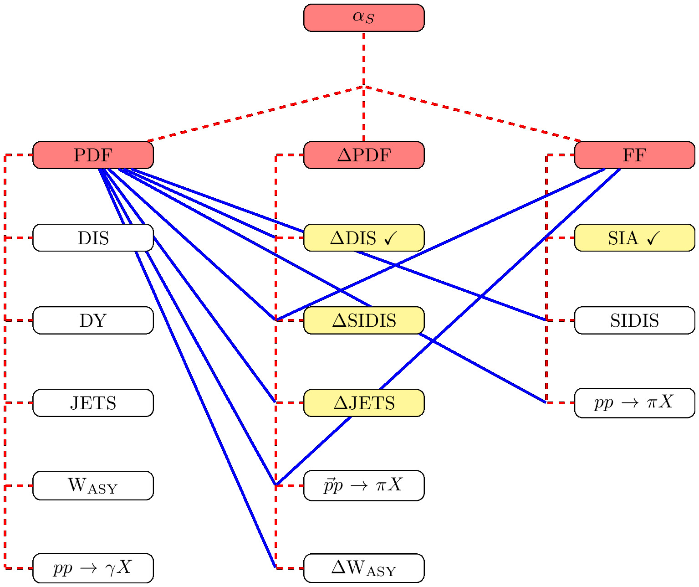
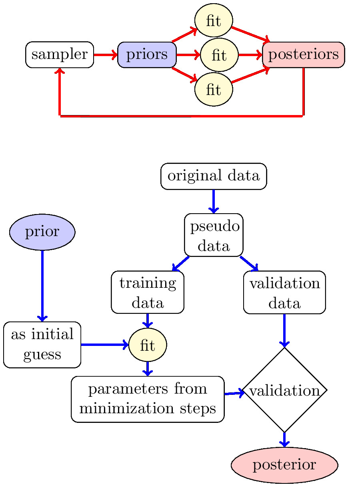

## About
 
The repository contains a collection of codes/scripts (in fortran, python,
mathematica), along with interpolation tables for the collinear parton
distributions in the nucleon, as well as the collinear parton to hadron
fragmentation functions. 

## Quick start
The codes can be downloaded in two ways

* [Download the latest release](https://github.com/JeffersonLab/JAMLIB/archive/master.zip).
*  Clone the repo:  `$ git https://github.com/JeffersonLab/JAMLIB.git`.

To get the latest update, pull from your local repo, e.g. `$ git pull`.

## Documentation
JAMLIB documentation is available in the [wiki](https://github.com/JeffersonLab/JAMLIB/wiki). 

## Theory
* The JAM analysis uses collinear factorization at NLO in perturbative QCD.
* For DIS data we include a treatment of higher twist as well as target mass corrections.
* We include nuclear corrections for DIS deuteron and 3He targets.
* (more details...)

## Roadmap
Tha main gloal of the JAM analysis is to perform a universal fit to extract
collinear spin-averaged and spin-dependent parton densities, as well as parton
to hadron fragmentation functions from all available data. At present the
observables with checkmarks has been included in the JAM analysis.

## Iterative Monte Carlo method 
The JAM analysis uses a novel fitting procedure based on Monte Carlo techniques
to have robust estimates of expectation values and variances of the extracted
distributions. (more details...)

## Authors:
* Nobuo Sato  (nsato@jlab.org)
* Jake Ethier 
* Wally Melnitchouk  
* Alberto Accardi

